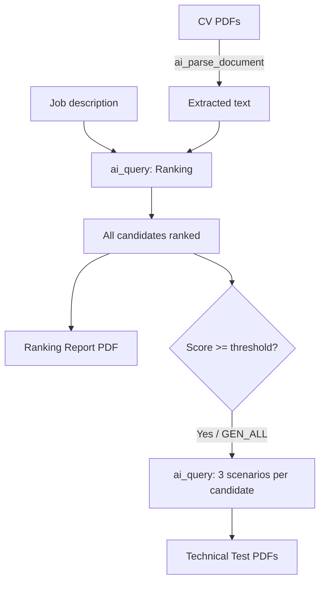
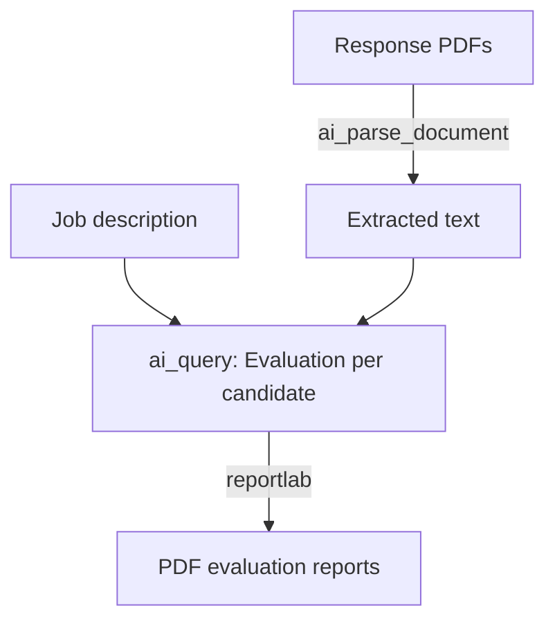
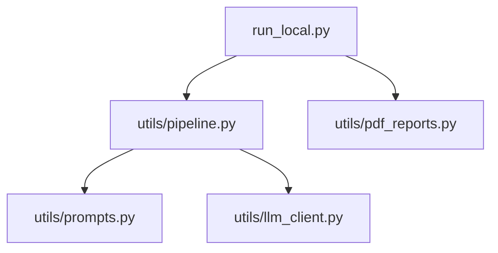

# CV Screening & Technical Evaluation Pipeline

Automated pipeline for screening candidate CVs, generating tailored technical tests, and evaluating candidate responses — powered by AI (Databricks or AWS Bedrock-compatible provider).

> **⚠️ Disclaimer**: This pipeline uses AI models to parse, evaluate, and generate content. AI outputs may contain errors, inaccuracies, or biases. All rankings, evaluations, technical tests, and reports **require human review** before being used in any hiring decision. This tool is designed to assist — not replace — human judgement in the recruitment process.

---

## Overview

The pipeline supports **two execution modes**:

| Mode | Backend | Entry point | PDF parsing |
|---|---|---|---|
| **DBX** (Databricks) | `ai_query` via Spark SQL | Notebooks on serverless compute | `ai_parse_document` |
| **LOCAL** | AWS Bedrock-compatible API (`boto3`) | `python run_local.py` | `pdfplumber` |

Controlled by `ENVIRONMENT` in `config.py` (`AUTO` / `DBX` / `LOCAL`).

```
candidates_manager_dbx/
├── config.py.example                    # Configuration template (commit this)
├── config.py                            # Local config with real values (gitignored)
├── build_setup.py                       # Bootstrap script: creates folders + config.py
├── run_local.py                         # Local runner (no Spark needed)
├── .gitignore
├── README.md
├── quick_start/                         # Quick-start guides (DBX & Local)
├── tech_scenarios_creator               # Notebook 1: CV ranking + test generation
├── tech_responses_evaluator             # Notebook 2: Technical response evaluation
├── utils/                               # Shared utility modules
│   ├── __init__.py
│   ├── config_loader.py                 #   Config import + validation (Databricks)
│   ├── llm_client.py                    #   LLM abstraction (DBX via OpenAI SDK + LOCAL via boto3 Bedrock)
│   ├── prompts.py                       #   Prompt templates (ranking, tests, evaluation)
│   ├── pipeline.py                      #   Core pipeline logic (for run_local.py)
│   ├── pdf_parser.py                    #   PDF parsing with ai_parse_document (DBX)
│   ├── job_description.py               #   Job description loading (local file)
│   ├── topic_pools.py                   #   Topic rotation for unique technical tests
│   └── pdf_reports.py                   #   PDF generation (tests, ranking, evaluations)
└── resources/                            # All input/output data (gitignored)
    ├── cvs_landing/                     # ↓ Input: candidate CV PDFs
    ├── job_description/                 # ↓ Input
    │   └── job_description.txt
    ├── images/                          # ↓ Input
    │   └── <company_logo>.png
    ├── technical_tests/                 # ↑ Output: one-page technical test PDFs
    ├── report_analysis/                 # ↑ Output: candidate ranking report PDF
    └── technical_responses/              # Candidate technical responses
        ├── landing/                     # ↓ Input: candidate response PDFs
        └── analysis/                    # ↑ Output: evaluation report PDFs
```

---

## Setup

### 1. Create the required folder structure

The easiest way is to run the bootstrap script:

```bash
python build_setup.py
```

This creates all required directories under `resources/` and generates `config.py` from `config.py.example` if it doesn't exist yet. The script is idempotent — safe to run multiple times.

Alternatively, create the folders manually:

```bash
mkdir -p resources/cvs_landing
mkdir -p resources/job_description
mkdir -p resources/images
mkdir -p resources/technical_tests
mkdir -p resources/report_analysis
mkdir -p resources/technical_responses/landing
mkdir -p resources/technical_responses/analysis
```

Then populate the input folders:

| Folder | What to place here |
|---|---|
| `resources/cvs_landing/` | Candidate CV files in **PDF** format |
| `resources/job_description/job_description.txt` | Plain-text description of the role to hire for |
| `resources/images/` | Company logo in **PNG** format *(optional)* |
| `resources/technical_responses/landing/` | Candidate technical response PDFs (for evaluation) |

Output folders (`technical_tests/`, `report_analysis/`, `technical_responses/analysis/`) are created automatically if missing.

### 2. Configuration

```bash
cp config.py.example config.py   # or run build_setup.py (does this automatically)
```

Edit `config.py`:

#### Common settings

| Variable | Description |
|---|---|
| `RESOURCES_BASE` | Auto-resolved from `config.py` location — points to `resources/` |
| `CVS_PATH` | Folder with candidate CV PDFs |
| `ROLE_DESCRIPTION_LOCAL_PATH` | Path to the job description `.txt` file |
| `TECHNICAL_RESPONSES_PATH` | Folder with candidate technical response PDFs |
| `LOGO_PATH` | Company logo PNG for PDF headers *(optional)* |
| `TECHNICAL_TESTS_OUTPUT_PATH` | Output folder for generated technical test PDFs |
| `EVALUATION_REPORTS_OUTPUT_PATH` | Output folder for the candidate ranking report PDF |
| `TECHNICAL_ANSWERS_ANALYSIS_PATH` | Output folder for evaluation report PDFs |
| `MIN_MATCH_THRESHOLD` | Minimum match % to generate a technical test (default: `70`) |
| `GENERATE_TESTS_FOR_ALL_CANDIDATES` | When `True`, generate technical tests for all candidates (default: `False`) |

#### Environment & AI model

| Variable | Description |
|---|---|
| `ENVIRONMENT` | `"AUTO"` (detect), `"DBX"` (force Databricks), or `"LOCAL"` (force local) |
| `AI_MODEL` | Databricks Foundation Model API endpoint (e.g. `databricks-claude-opus-4-6`) |
| `API_KEY` | API key for local mode (set as `AWS_BEARER_TOKEN_BEDROCK` at runtime) |
| `API_BASE_URL` | Bedrock-compatible endpoint URL |
| `LOCAL_AI_MODEL` | Model name for local mode (e.g. `claude-opus-4.6`) |

All paths are resolved **relative to `config.py`** using `os.path`, so the project works for any user without hardcoded paths.

### 3. Compute requirements

**Databricks mode:**
- **Databricks Serverless** compute with Foundation Model API access
- `reportlab` (installed automatically via `%pip` in each notebook)

**Local mode:**
- Python 3.9+
- `pip install boto3 pdfplumber reportlab`
- An API key for a Bedrock-compatible provider

---

## Databricks Mode (Notebooks)

### Notebook 1: `tech_scenarios_creator`

**Purpose**: Parse candidate CVs, rank them against a job description, generate a ranking summary report, and produce one-page technical tests as PDFs.

#### Pipeline flow



#### Cells (execution order)

| # | Cell | Description |
|---|---|---|
| 1 | **Install reportlab** | `%pip install reportlab` |
| 2 | **Setup & Configuration** | Imports config via `utils.config_loader`, validates all required variables and paths |
| 3 | **Parse candidate CVs** | Uses `utils.pdf_parser` to read and parse all PDFs into a Spark temp view |
| 4 | **Load job description** | Uses `utils.job_description` to load from local file |
| 5 | **Rank candidates with AI** | Evaluates each CV via `ai_query`, assigns match percentage and metadata |
| 6 | **Generate technical tests with AI** | For eligible candidates, generates 3 scenarios via `ai_query` |
| 7 | **Generate PDF reports** | Uses `utils.pdf_reports` to create technical test PDFs + ranking report |

### Notebook 2: `tech_responses_evaluator`

**Purpose**: Parse candidate technical responses, evaluate them against the job description, and generate professional PDF evaluation reports.

#### Pipeline flow



#### Cells (execution order)

| # | Cell | Description |
|---|---|---|
| 1 | **Install reportlab** | `%pip install reportlab` |
| 2 | **Setup & Configuration** | Imports config via `utils.config_loader`, validates all required variables and paths |
| 3 | **Parse candidate response PDFs** | Uses `utils.pdf_parser` to read and parse response PDFs into a Spark temp view |
| 4 | **Load job description** | Uses `utils.job_description` to load from local file |
| 5 | **Evaluate responses with AI** | Evaluates each response via `ai_query` with structured JSON output |
| 6 | **Generate evaluation PDF reports** | Uses `utils.pdf_reports` to create colour-coded evaluation reports per candidate |

---

## Local Mode (`run_local.py`)

**Purpose**: Run the same pipeline from any machine with Python 3.9+ — no Databricks required.

### Quick start

```bash
pip install boto3 pdfplumber reportlab
cp config.py.example config.py
# Edit config.py: set API_KEY, API_BASE_URL, LOCAL_AI_MODEL
python run_local.py scenarios   # rank CVs + generate tests
python run_local.py evaluate    # evaluate responses
python run_local.py all         # run both
```

### Architecture



`llm_client.py` supports two backends:
- **DBX**: `openai` SDK — auto-retrieves workspace token + host, calls the Foundation Model API
- **LOCAL**: `boto3` Bedrock `converse` API — uses `API_KEY` + `API_BASE_URL` + `LOCAL_AI_MODEL` from `config.py`

### Candidate filtering

| Parameter | Value | Behaviour |
|---|---|---|
| `GENERATE_TESTS_FOR_ALL_CANDIDATES` | `False` (default) | Only candidates with match score **≥ `MIN_MATCH_THRESHOLD`** receive a technical test |
| `GENERATE_TESTS_FOR_ALL_CANDIDATES` | `True` | All candidates receive a technical test, regardless of score |
| `MIN_MATCH_THRESHOLD` | `70` (default) | Minimum match % to qualify for test generation |

---

## AI Functions & Providers

| Context | Technology | Purpose |
|---|---|---|
| **DBX notebooks** | `ai_query` (Spark SQL) | LLM-based evaluation and generation |
| **DBX notebooks** | `ai_parse_document` (Spark SQL) | PDF text extraction |
| **Local mode** | `boto3` Bedrock `converse` API | LLM calls to Bedrock-compatible gateway |
| **Local mode** | `pdfplumber` | PDF text extraction |

---

## Output PDF naming convention

All generated PDF filenames include a timestamp (`DD_MM_YYYY_HH_MM`):

| Report type | Filename pattern |
|---|---|
| Technical test | `Technical_Test_<Candidate Name>.pdf` |
| Candidate ranking | `Candidate_Ranking_Report_DD_MM_YYYY_HH_MM.pdf` |
| Evaluation report | `Evaluation_Report_<Candidate Name>_DD_MM_YYYY_HH_MM.pdf` |
